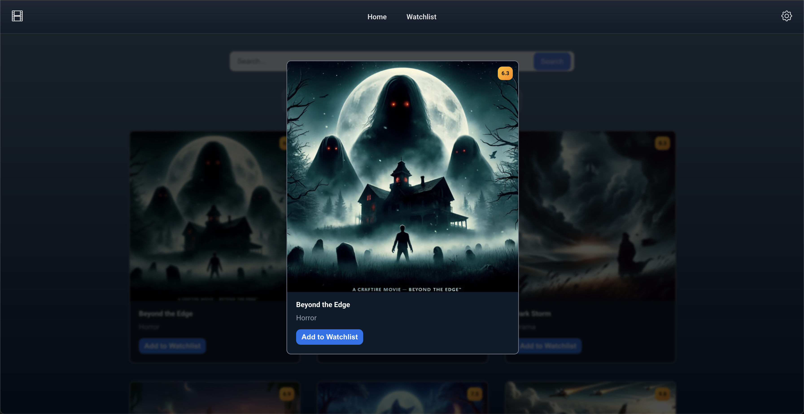

# MOVIER

## UI

- Web view of the app
  

- Mobile view of the app
  

- Card modal for more information
  

## Wireframe

Webview

## TRELLO LINK

[Access this link for the trello kanban board.](https://trello.com/invite/b/698adb44baebfd8422bca173/ATTI7e1f321850aa54f30c44470009bf3b59189CD25E/movie-app)

## TODOS

- ~~each individual movie should be accessible through url directly using the movie individual (ex: movies/344)~~

- ~~a filtered movie list should be accessible through url directly using query paremeters (ex: movies?search=Avengers&order=asc)~~

- ~~use a nested route to keep the header and navigation bar "static" and use a child route for the page content~~

- ~~show active state for the navigation links~~

- ~~create wireframe~~

- ~~create MVP design~~

- ~~main search of a movie~~

- ~~Filter by name in search input, filter by genre~~

- ~~Sort by rating or alphabetically~~

- ~~Show more details in a modal when clicking on a movie card~~

- ~~two pages: Home and Watchlist.~~

- checking for localstorage items, to be the ids 100% in case someone changes it we have to clear the local storage

## sfaturi

- tagul title pentru tool tip la butoane
- elementele in prim plan(imagini nu ar trebui sa isi dea resize, trebuie sa ramane la fel)
- pot sa opresc elemente sa nu depaseasca mai mult de 2 randuri pun ... , dau hover peste el si zice titlull in tooltip
